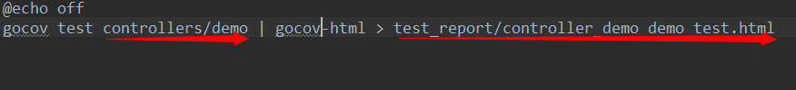

#覆盖率测试 *by lmx*

+  ### __如果要对包内的函数进行覆盖率测试，请在src_package.bat中添加如下语句：__

>      gocov test package_name | gocov-html > report_path
>      其中 package_name 为要测试的包名, report_path 为测试报告输出的全路径，后缀为 .html
>      例如：
>      要测试controllers/demo中代码覆盖率,测试报告输出到test_report/controller_demo_demo_test.html中
> 

+  ### __测试时运行go_test.bat即可。__

---

####注：暂时测试成功的必须把要测试的代码和源代码放在同一包里，之后找到配置方法后在完善。

>       如图：
> 
